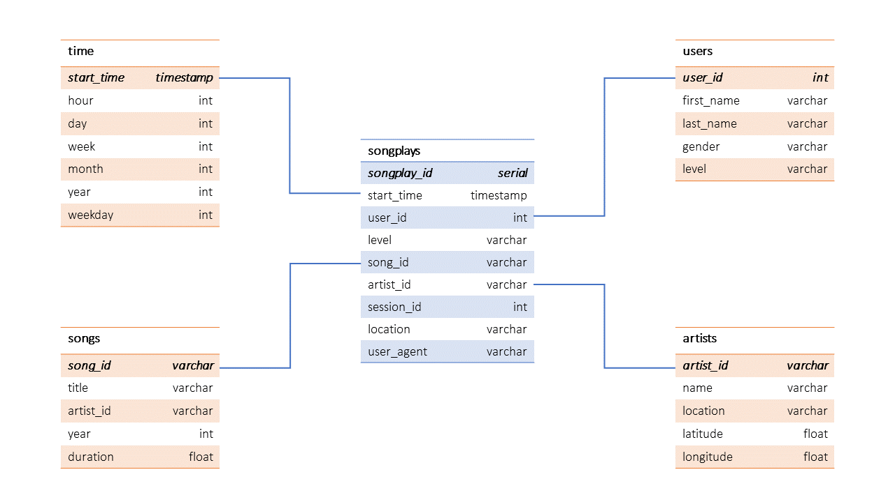

# Data Modeling with Postgres

## Introduction

A fictional startup called Sparkify - an audio streaming provider, has been collecting a lot of data on their songs and user activity. They want to analyze the data they've been collecting on their new music streaming app. The analytics team is particularly interested in understanding what songs users are listening to, so the team can make assertive recommendation to the business areas on alternatives to raise the company's profit.

This project sought to create a Postgres database with tables designed in a star schema. These tables were designed to easily query data for analysis. Also, this project includes an ETL pipeline.

## Project structure

Files used on the project:
1. **data** folder which includes all needed jsons - song dataset and log dataset.
2. **sql_queries.py** contains all SQL queries needed to create and drop tables, as well as find data.
3. **create_tables.py** drops and creates tables. You run this file to reset your tables before each time you run your ETL scripts.
4. **test.ipynb** displays the first few rows of each table to let you check your database. Also, it includes validation tests.
5. **etl.py** reads and processes files from song_data and log_data and loads them into the tables. 
6. **etl.ipynb** reads and processes a single file from song_data and log_data and loads the data into the tables. It was used for testing the queries before scripting the **etl.py** file.
7. **README.md** provides discussion on the project.

## Schema Design

By analysing the JSON files, I could observe that the data had little complexity and was not very large. So, it was better suited to design a Star Schema for the data as it would not require much complex queries for analysis and it would make the data look organized enough for the Sparkify's Analytics Team. Therefore, for more flexibility, the data was designed in a Star Schema including 1 fact table and 4 dimensional ones, as follows:

    - songplays table (fact)
    - users (dimensional)
    - artists (dimensional)
    - time (dimensional)
    - songs (dimensional)




## ETL Pipeline

The ETL Pipeline seeks to transfer data from JSON files, which are located in 2 local directories, to the tables described in the **Schema Design section**. The ETL script includes Python and SQL.

- **Song dataset**: 

The song dataset is a subset of real data from the Million Song Dataset. Each file is in JSON format and contains metadata about a song and the artist of that song. The files are partitioned by the first three letters of each song's track ID, as follows:

```
song_data/A/B/C/TRABCEI128F424C983.json
song_data/A/A/B/TRAABJL12903CDCF1A.json
```

All json files are nested in subdirectories under **/data/song_data**. A sample of this file is:

```
{
    "num_songs": 1,
    "artist_id": "ARJIE2Y1187B994AB7",
    "artist_latitude": null,
    "artist_longitude": null,
    "artist_location": "",
    "artist_name": "Line Renaud",
    "song_id": "SOUPIRU12A6D4FA1E1",
    "title": "Der Kleine Dompfaff",
    "duration": 152.92036,
    "year": 0
}
```

- **Log dataset**: 

The log dataset consists of log files in JSON format generated by an event simulator based on the songs in the dataset above. These simulate activity logs from a music streaming app based on specified configurations.

The log files in the dataset are partitioned by year and month, as follows:

```
log_data/2018/11/2018-11-12-events.json
log_data/2018/11/2018-11-13-events.json
```

All json files are nested in subdirectories under **/data/log_data**. A sample is given as follows:

```
{
    "artist":"Slipknot",
    "auth":"Logged In",
    "firstName":"Aiden",
    "gender":"M",
    "itemInSession":0,
    "lastName":"Ramirez",
    "length":192.57424,
    "level":"paid",
    "location":"New York-Newark-Jersey City, 
    NY-NJ-PA",
    "method":"PUT",
    "page":"NextSong",
    "registration":1540283578796.0,
    "sessionId":19,
    "song":"Opium Of The People (Album Version)",
    "status":200,
    "ts":1541639510796,
    "userAgent":"\"Mozilla\/5.0 (Windows NT 6.1) AppleWebKit\/537.36 (KHTML, like Gecko) Chrome\/36.0.1985.143 Safari\/537.36\"",
    "userId":"20"}
```

## How to run the Python scripts

1. Run **create_tables.py** from terminal to set up the database and tables.
2. Run **etl.py** from terminal to process and load data into the tables.
3. Run **test.ipynb** for validation queries.